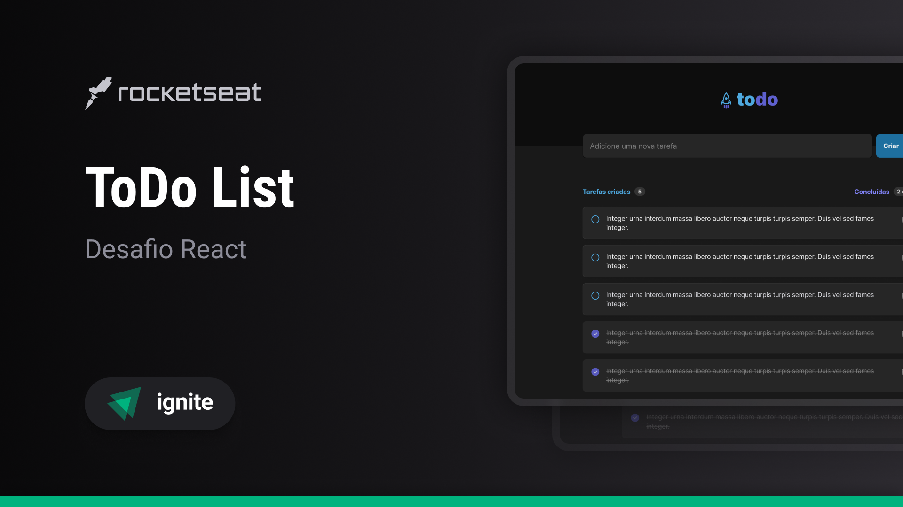

<h1 align="center">   </h1>

Programa exclusivo do curso Ignite, promovido pela Rocketseat para ensino de tecnologias WEB.  

  <a href="#-tecnologias">Tecnologias</a>&nbsp;&nbsp;&nbsp;|&nbsp;&nbsp;&nbsp;
  <a href="#-projeto">Projeto</a>&nbsp;&nbsp;&nbsp;|&nbsp;&nbsp;&nbsp;
  <a href="#-layout">Layout</a>&nbsp;&nbsp;&nbsp;|&nbsp;&nbsp;&nbsp;
  <a href="#-aprendizado">Aprendizado</a>&nbsp;&nbsp;&nbsp;|&nbsp;&nbsp;&nbsp;
  <a href="#-crescimento">Crescimento</a>&nbsp;&nbsp;&nbsp;|&nbsp;&nbsp;&nbsp;
  <a href="#-funcionalidades">Funcionalidades</a>&nbsp;&nbsp;&nbsp;|&nbsp;&nbsp;&nbsp;
  <a href="#-instrucoes">Instruções</a>&nbsp;&nbsp;&nbsp;|&nbsp;&nbsp;&nbsp;
  <a href="#-requisitos">Requisitos</a>&nbsp;&nbsp;&nbsp;|&nbsp;&nbsp;&nbsp;
  <a href="#memo-licença">Licença</a>
  

  

  

## 🚀 Tecnologias

Esse projeto foi desenvolvido com as seguintes tecnologias:

-   ⛛. ReactJS
-   ⛛. TypeScript
-   ⛛. Vite
-   ⛛. Phosphor-react
-   ⛛. Date-fns
-   ⛛. Git e Github
-   ⛛. Figma

## 💻 Projeto

Em construção.

-   [Acesse o projeto finalizado, online - Em construção]()

-   [Assistir aulas](https://www.rocketseat.com.br/ignite)

## 🔖 Layout

Você pode visualizar o layout do projeto através [DESSE LINK](https://www.figma.com/file/0n0zDN7zbzhRbaEO74Xesx/ToDo-List-%E2%80%A2-Desafio-React/duplicate?type=design&node-id=56-96&mode=design). É necessário ter conta no [Figma](https://figma.com) para acessá-lo.

## 📚 Aprendizado

Em construção.

## 📊 Crescimento

Após a conclusão do projeto, um desafio é lançado visando o crescimento e a busca pelo próximo nível.

#### Nesse sentido, foram implementadas as seguintes melhorias:

Em construção.

## ⚙ Funcionalidades

Em construção.

## 📑 Instruções

-   Clonar repositório: <pre> git clone https://github.com/Letimberg/toDo-List-reactjs-ts.git </pre>
-   Instalar dependências: <pre>npm i</pre>
-   Instalar dependências extra:
    <pre>
    npm i phosphor-react 
    npm i date-fns
    </pre>
-   Iniciar o servidor local: <pre>npm run dev</pre>
-   Acessar o projeto: <pre>http://localhost:8081/</pre>

## 🚧 Requisitos

-   Node: v18.17.1
-   React: v18.2.0
-   Vite: v4.4.11

## :memo: Licença

Esse projeto está sob a licença MIT.

---

Feito com ♥ by Rocketseat :wave: [Participe da comunidade!](https://discord.gg/rocketseat)

